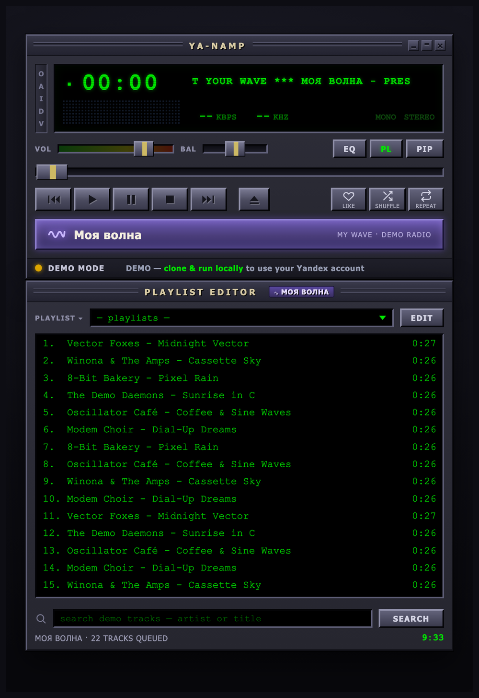

# ya-namp

A **Yandex Music** player wearing a classic **Winamp** skin, on the web.

### ▶︎ [Live demo → **lifeart.github.io/ya-namp**](https://lifeart.github.io/ya-namp/)

The live demo runs **entirely in your browser** — six procedurally-synthesized
tracks with a real 10-band equalizer, "Моя волна" AI radio, playlists and search,
no server and no account. Clone and run locally to connect your own Yandex Music
account for the real catalog.

<p align="center">
  <a href="https://lifeart.github.io/ya-namp/">
    
  </a>
</p>

Green-LCD marquee, spectrum analyzer, chunky transport, a playlist editor, and a
working Web Audio equalizer — driven by the real Yandex Music API, with a fully
offline **demo mode** so it runs end-to-end without any credentials.

```
┌─ shared ─┐   the typed API contract (shared/types.ts)
├─ server ─┤   Express + TS: Yandex proxy, streaming, demo audio
└─ client ─┘   Vite + TS: the Winamp UI (vanilla, no framework)
```

## Download & install

Just want to run it? Grab a **prebuilt binary** or the **container image** — no
Node and no `npm install` required. Both are produced automatically for every
release (a `vX.Y.Z` tag push runs
[`.github/workflows/release.yml`](./.github/workflows/release.yml)).

### Prebuilt binary (no Node install)

Download the archive for your OS from the
[**Releases**](https://github.com/lifeart/ya-namp/releases) page, extract it, and
run the binary:

```bash
# macOS (arm64) / Linux (x64): extract the .tar.gz, then
./ya-namp/server/dist/ya-namp
# Windows (x64): extract the .zip, then
ya-namp\server\dist\ya-namp.exe
```

Then open **http://localhost:8058** — it boots in offline **demo mode**. For your
real Yandex catalog, pass `YANDEX_TOKEN=...` (or drop a `.env` containing
`YANDEX_TOKEN=...` next to the binary, at `ya-namp/.env`):

```bash
YANDEX_TOKEN=... ./ya-namp/server/dist/ya-namp   # Windows: set YANDEX_TOKEN=... first
```

These are [Node SEA](https://nodejs.org/api/single-executable-applications.html)
executables and are **per-OS** — macOS **arm64**, Linux **x64**, Windows **x64**
(SEA can't cross-compile). Keep the whole extracted `ya-namp/` folder together:
the binary serves the SPA from the `client/dist/` shipped alongside it.

### Container image (ghcr.io)

Pull the prebuilt multi-arch image (`linux/amd64` + `linux/arm64`) from GitHub
Container Registry:

```bash
docker pull ghcr.io/lifeart/ya-namp:latest
docker run -d -p 8058:8058 ghcr.io/lifeart/ya-namp:latest
# real account:  add  -e YANDEX_TOKEN=...
# open http://localhost:8058
```

`latest` tracks the newest release tag; specific versions are tagged `X.Y.Z` and
`X.Y`. After the first publish the package may need to be flipped to **public**
once (repo → **Packages** → *ya-namp* → *Package settings* → change visibility)
before anonymous `docker pull` works.

## Run it

```bash
npm install
npm run dev        # server on :8058, client on :5173 → open http://localhost:5173
```

Out of the box it runs in **demo mode**: six procedurally-synthesized tracks are
generated in memory, so search, streaming (with seek/Range), My Wave, and the
visualizer all work with zero credentials or network.

## Features

- **Winamp classic UI** — beveled chrome, green CRT LCD, scrolling marquee,
  spectrum/oscilloscope visualizer (click to cycle), seek + volume + balance
  sliders, playlist editor. Keyboard: `Z X C V B` transport, `space` play/pause,
  `S` shuffle, `R` repeat, `W` My Wave.
- **Playback** — gapless-feeling transport with HTTP **Range/seek**, volume &
  balance; the same stream path serves demo audio and proxied Yandex audio.
- **Search any track** — type in the playlist search box (or press the eject
  button); results become the playlist. Hits the full Yandex catalog when
  connected, the demo catalog otherwise.
- **Playlists** — browse your Yandex playlists, open one as the playlist, and
  **create** new playlists, **add** tracks to an existing one, and rearrange via
  the playlist **edit mode**. (Editing needs a connected account.)
- **Likes** — heart any track to like/unlike it against your account; liked
  state is loaded on connect.
- **10-band graphic EQ** — classic Winamp equalizer with per-band gain, applied
  live via the Web Audio graph.
- **Моя волна / My Wave** — Yandex's personalized AI radio. The playlist becomes
  a live "coming up" queue that **auto-extends** as you near the end; playback
  events are reported back so the wave adapts. Simulated from the demo catalog
  when not connected.
- **Repeat & shuffle** — Winamp-style: repeat cycles **off → all → one**, where
  **one** loops the current track (loop-per-track). Shuffle randomizes next.

## Connect your real Yandex account (optional)

Two ways to supply a token — the server holds it in memory and forwards it as
`Authorization: OAuth <token>`; it never touches source control.

**A. Paste in the app** — the "paste yandex oauth token" field → Connect.

**B. `.env` for a boot-time connection**

```bash
npm run set-token      # paste your token when prompted; it validates + writes .env
npm run dev            # server now boots in yandex mode
```

Getting a token (the token is short-lived — re-run `set-token` when it expires):

1. Open, logged in to Yandex:
   `https://oauth.yandex.ru/authorize?response_type=token&client_id=23cabbbdc6cd418abb4b39c32c41195d`
2. Approve — you land on a URL containing `#access_token=…`.
3. Copy that value and feed it to `npm run set-token`.

`.env` is gitignored; `set-token` writes it with `600` perms and only ever prints
your login, never the token.

## API surface

The client speaks one contract (`shared/types.ts`); the server implements it in
demo and yandex modes identically.

| Method | Path | Purpose |
|---|---|---|
| GET  | `/api/status` | current mode + account |
| POST | `/api/token` | validate + store an OAuth token |
| GET  | `/api/search?q=` | search tracks |
| GET  | `/api/stream/:id` | audio bytes (HTTP Range) |
| GET  | `/api/wave?after=` | next My Wave batch |
| POST | `/api/wave/feedback` | report a wave playback event |
| GET  | `/api/playlists` | list playlists |
| GET  | `/api/playlists/:id/tracks` | tracks in a playlist |
| POST | `/api/playlists/create` | create a playlist |
| POST | `/api/playlists/:id/add` | add tracks to a playlist |
| GET  | `/api/liked-ids` | liked track ids |
| POST | `/api/like` | like / unlike a track |

See `docs/yandex-api.md` for the probed Yandex endpoints and the streaming
signature flow.

## Deploy

### Docker / Podman (Synology-ready)

A prebuilt image is published to **ghcr.io** on every release — see
[Download & install](#container-image-ghcrio) to just `docker pull` it. The steps
below build it yourself.

The app packages into a small `node:22-alpine` image (one bundled server file +
the built SPA, **no `node_modules`**) listening on **port 8058**, runnable as
root — which is how Synology DSM starts containers.

```bash
npm run image:build     # builds ya-namp:latest + dist/ya-namp.tar (Synology import)
podman run -d --name ya-namp -p 8058:8058 --restart unless-stopped ya-namp:latest
# real account:  add  -e YANDEX_TOKEN=...   (or mount a .env at /app/.env)
# open http://localhost:8058
```

There's also a [`docker-compose.yml`](./docker-compose.yml) at the repo root.
Full Synology DSM Container Manager walkthrough (GUI + CLI + compose, token
setup, the `localhost/` prefix note): **[docs/deploy.md](./docs/deploy.md)**.

### Single binary (no Node install)

Prebuilt binaries for macOS/Linux/Windows are attached to every
[release](#prebuilt-binary-no-node-install) — grab one instead of building. To
produce your own, ship ya-namp as a self-contained executable via Node 22 SEA:

```bash
npm run build:binary    # → dist/ya-namp/server/dist/ya-namp (+ client/dist alongside)
./dist/ya-namp/server/dist/ya-namp
```

Trade-offs, the Bun `--compile` cross-compile path, and the one small server
change for a truly single *file*: **[docs/single-binary.md](./docs/single-binary.md)**.

### GitHub Pages (static, server-less demo)

`npm run build:pages` produces a static `client/dist` (base `/ya-namp/`) with **no
backend** — the demo audio is synthesized in the browser and every `/api/*` call
is served by a client-side stub, so the full demo (playback, seek, My Wave, EQ,
playlists) works as pure static files. A push to `main`/`master` auto-deploys it
to Pages via [`.github/workflows/pages.yml`](./.github/workflows/pages.yml).
The Yandex-account features are hidden in this build (they need the local server).

## Disclaimer

ya-namp is an **unofficial**, personal/educational project — **not affiliated with,
endorsed by, or connected to Yandex**. It talks to Yandex Music's private API using
a token *you* supply for *your own* account; full-quality playback needs an active
**Yandex Plus** subscription, and your use is subject to Yandex Music's Terms of
Service. No credentials are bundled or committed — `.env` is gitignored, and the
GitHub Pages demo contains only in-browser synthesized audio.

## Scripts

- `npm run dev` — server + client with hot reload
- `npm run build` — build the client to `client/dist`
- `npm run build:server` — bundle the server to `server/dist/index.mjs` (esbuild, express baked in)
- `npm run build:all` — build the client **and** the server bundle
- `npm run build:pages` — build the static, server-less demo for GitHub Pages
- `npm start` — build the client and serve it from the server (single origin)
- `npm run image:build` — build the container image + a Synology-importable tar (`dist/ya-namp.tar`)
- `npm run build:binary` — build a self-contained SEA executable (`dist/ya-namp/…`)
- `npm run typecheck` — typecheck both workspaces
- `npm run set-token` — write a Yandex token to `.env`
